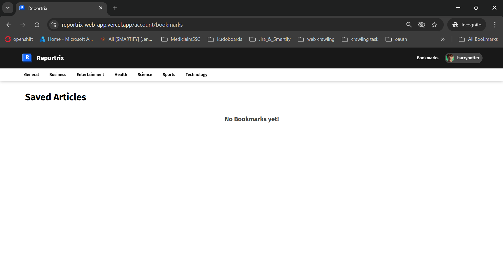

<h1 align="center">📰 Reportrix - WebApp</h1>

<p align="center">
  <a href="https://reportrix-web-app.vercel.app/"><strong>Live Demo</strong></a>   •   
  <a href="https://contact-form-react-sepia.vercel.app/"><strong>Contact Me</strong></a>
</p>

<p align="center">
  
  
  
  
  
</p>

**Reportrix** is a modern and responsive news aggregator web app built using **React**, styled with **SCSS**, and powered by real-time data from [NewsAPI.org](https://newsapi.org/). Users can explore a variety of news categories, authenticate securely, and bookmark their favorite articles for later reading.

**Reportrix** helps users find curated news articles from multiple categories and bookmark them for convenient access. It offers a clean, user-friendly experience with real-time content fetched using the [NewsAPI](https://newsapi.org/).

---

## ✨ Features

- 🗂️ **Categories**  
  Discover news across topics like health, sports, technology, and entertainment.

- 🧠 **Redux Toolkit Integration**  
  Efficient global state management using `@reduxjs/toolkit` and `react-redux`.

- 🧩 **Context API**  
  Manages authentication and user-specific data separately from Redux.

- 🧭 **User-Friendly Navigation**  
  Clean routing and page transitions across the app.

- 📰 **News Page**  
  Browse curated articles based on selected categories via `/news`.

- 🔐 **User Authentication**  
  - Log in with your email and password.
  - Register a new account.
  - Easily switch between login and registration.

- 📌 **Bookmark Functionality**  
  Bookmark articles and view them at `/account/bookmarks`.

---

## 🏗️ Project Structure

```plaintext
/public # Static assets (e.g., icons, images)
└── index.html

/src # React source code
├── /app # Redux store setup
├── /components # Reusable components
├── /context # Context API providers
├── /features # Redux slices
├── /lib # Firebase config, utility functions
├── /pages # Main application pages
├── /routes # Application routing
├── /style # SCSS styles
└── main.jsx # Entry point
```

---

## 🛠️ Installation:

To run this project locally:

```bash
    git clone https://github.com/deepanshubajaj/Reportrix-WebApp.git
```
```bash
    npm install
```
```bash
    npm start   # To start the application
```

Once the development server is up and running, open your web browser and go to `http://localhost:3000` to see the project in action.

---

## Set up environment variables:

Create .env file

```env
# Firebase Configuration
REACT_APP_FIREBASE_API_KEY=your_firebase_api_key
REACT_APP_FIREBASE_AUTH_DOMAIN=your_firebase_auth_domain
REACT_APP_FIREBASE_PROJECT_ID=your_firebase_project_id
REACT_APP_FIREBASE_MESSAGING_SENDER_ID=your_firebase_messaging_sender_id
REACT_APP_FIREBASE_APP_ID=your_firebase_app_id
REACT_APP_FIREBASE_MEASUREMENT_ID=your_firebase_measurement_id

# Cloudinary Configuration
REACT_APP_CLOUDINARY_CLOUD_NAME=your_cloudinary_cloud_name
REACT_APP_CLOUDINARY_API_KEY=your_cloudinary_api_key
REACT_APP_CLOUDINARY_API_SECRET=your_cloudinary_api_secret
REACT_APP_CLOUDINARY_UPLOAD_PRESET=your_cloudinary_upload_preset
REACT_APP_CLOUDINARY_FOLDER_NAME=your_cloudinary_folder_name

# News API Configuration
REACT_APP_NEWS_API_KEY=your_news_api_Key

# Other Configuration
REACT_APP_CREATOR_NAME=your_name
REACT_APP_FACEBOOK=your_facebook_url
REACT_APP_INSTAGRAM=your_instagram_url
REACT_APP_LINKEDIN=your_linkedin_url
REACT_APP_GITHUB=your_github_url
REACT_APP_TWITTER=your_twitter_url

# Temp Login Credentials
REACT_APP_USER1_EMAIL=your_temp_id_1
REACT_APP_USER1_PASSWORD=your_temp_password_1
REACT_APP_USER2_EMAIL=your_temp_id_2
REACT_APP_USER2_PASSWORD=your_temp_password_2

# Others
CI=false
```

## 🛠 Technologies Used

| Technology       | Description                                           |
|------------------|-------------------------------------------------------|
| ⚛️ **React**        | JavaScript library for building user interfaces       |
| 🧠 **Redux Toolkit** | Simplified global state management                    |
| 🌐 **Context API**   | Handles authentication and local states              |
| 🎨 **SCSS**          | Enhanced styling with Sass syntax                    |
| 🔥 **Firebase**      | Used for authentication and backend services         |
| ☁️ **Cloudinary**    | Image hosting and transformation service            |
| 📰 **NewsAPI**       | Source for real-time news data                       |
| 📦 **Axios**         | Promise-based HTTP client for API requests          |
| 🛣️ **React Router**  | Declarative routing for navigation                   |


---

## ⚙️ API Reference & Usage

### 📰 NewsAPI.org


- **Source**: [https://newsapi.org](https://newsapi.org)
- **Purpose**: Fetches real-time news articles based on category, search keyword, and region.
- **Authentication**: Requires an API key via `REACT_APP_NEWS_API_KEY` in `.env`.

Example usage:
```js
axios.get(`https://newsapi.org/v2/top-headlines?category=technology&apiKey=${API_KEY}`);
```

---

---

### 🖼️ Icon:

<p align="center">
  
</p>

<p align="center">
  *This is the App Icon.*
</p>

---

## 🖼️ Screenshots:

<p align="center">
  
</p>

##

<p align="center">
  
</p>

##

<p align="center">
  
</p>

##

<p align="center">
  
</p>

##

<p align="center">
  
</p>

##

<p align="center">
  
</p>

##

<p align="center">
  
</p>

##

<p align="center">
  
</p>

##

<p align="center">
  
</p>

##

<p align="center">
  
</p>

##

<p align="center">
  
</p>

##

<p align="center">
  
</p>

##

<p align="center">
  
</p>

##

<p align="center">
  
</p>

##

<p align="center">
  
</p>

##

<p align="center">
  
</p>

##

<p align="center">
  
</p>

##

<p align="center">
  
</p>

##

<p align="center">
  
</p>

##

<p align="center">
  
</p>

##

<p align="center">
  
</p>

##

<p align="center">
  *Snapshots of the running Application*
</p>

---

## 🚀 Video Demo:

Here’s a short video showcasing the app's functionality:

[Watch the Working Demo](https://github.com/user-attachments/assets/ef4a97bf-8464-4c99-8461-f9c3a49e0277)

##

➤ <a href="ProjectOutputs/WorkingVideos/WorkingVideo.mp4">🎥 Watch Working Video</a>

---

## 🤝 Contributing

Thank you for your interest in contributing to this project!  
I welcome contributions from the community.

- You are free to use, modify, and redistribute this code under the terms of the **Apache-2.0 License**.
- If you'd like to contribute, please **open an issue** or **submit a pull request**.
- All contributions will be reviewed and approved by the author — **[Deepanshu Bajaj](https://github.com/deepanshubajaj?tab=overview&from=2025-03-01&to=2025-03-31)**.

---

## 📌 How to Contribute

To contribute:

1. Fork the repository.

2. Create a new branch:
   ```bash
   git checkout -b feature/your-feature-name
   ```

3. Commit your changes:
   ```bash
   git commit -m 'Add your feature'
   ```

4. Push to the branch:
   ```bash
   git push origin feature/your-feature-name
   ```

5. Open a pull request.

---

## 📃 License

This project is licensed under the [Apache-2.0 License](./LICENSE).  
You are free to use this project for personal, educational, or commercial purposes — just make sure to provide proper attribution.

> **Clarification:** Commercial use includes, but is not limited to, use in products,  
> services, or activities intended to generate revenue, directly or indirectly.

---

## 📩 Contact:

You can reach out to me [here](https://contact-form-react-sepia.vercel.app/).